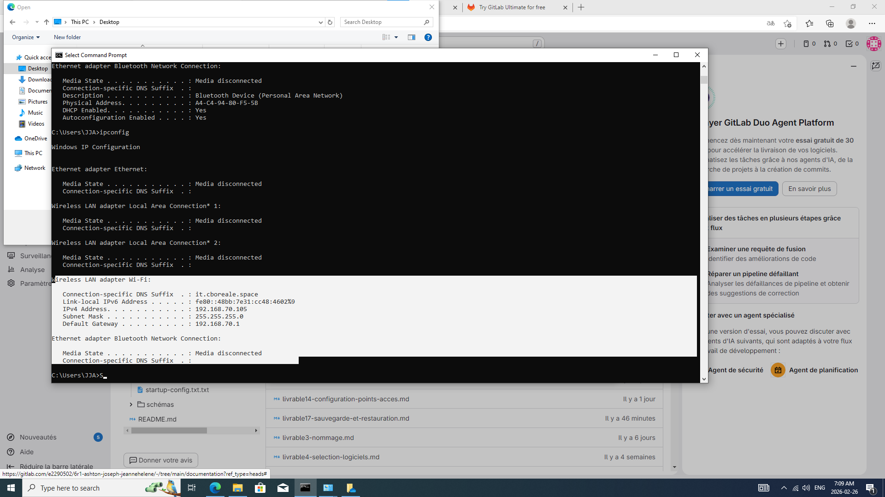
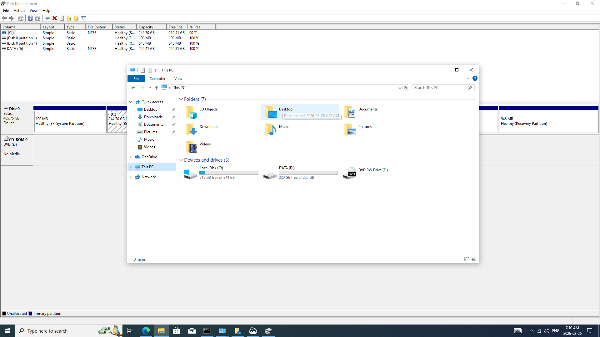
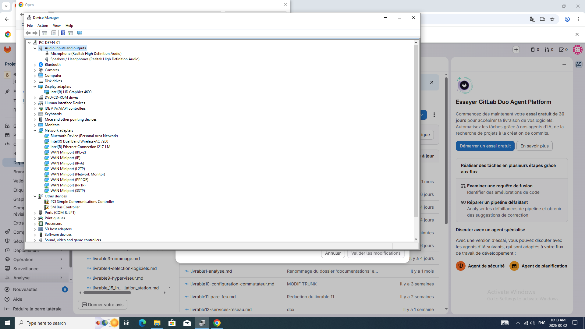
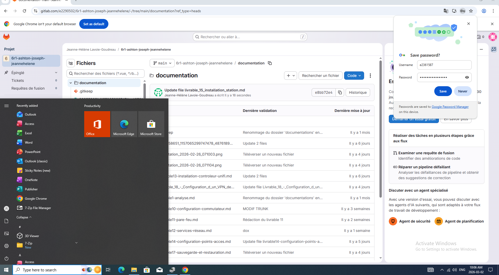

# Documentation – Configuration de la station de travail

## Informations générales sur la station

- **Modèle :** Dell  
- **Processeur :** i5-4590S  
- **Mémoire RAM :**  8G DDR3
- **Type de disque :**  SATA SSD
- **Carte réseau :**  Intel(R) Dual Band Wireless-AC 7260
- **Version de Windows installée :** Windows 10  
- **Nom de la machine sur le réseau :**  PC-D3744-01
- **Adresse IPv4 :** 192.168.70.105(dhcp)  
- **Masque de sous-réseau :** 255.255.255.0
- **Passerelle par défaut :** 192.168.70.1  
- **Serveur DNS :**  192.168.85.3

### Capture d’écran – Résultat de `ipconfig /all`

---

## Partitionnement du disque

- **Partition C: (Système) – Taille 244GB:**  
  - Utilisation : Windows et logiciels  

- **Partition D: (DATA) – Taille 220GB :**  
  - Utilisation : Données de sauvegarde  

### Capture d’écran – Lecteurs C: et D:

---

## Joindre au domaine Active Directory et configuration GPO

- **Nom du domaine :** it.cboreale.space  
- **Statut d’intégration :** Station jointe au domaine  

---

## Installation des pilotes (drivers)

- **Source des pilotes téléchargés :**  
- **Statut :** Tous les pilotes sont installés correctement (aucun périphérique non reconnu)

### Capture d’écran – Gestionnaire de périphériques

---

## Logiciels installés

- **Office 365 – Version :**  
  - Objectif : Bureautique  

- **7-Zip– Version :**  
  - Objectif : Compression de fichiers  

- **Chrome**  
  - Objectif : Navigation web
  
