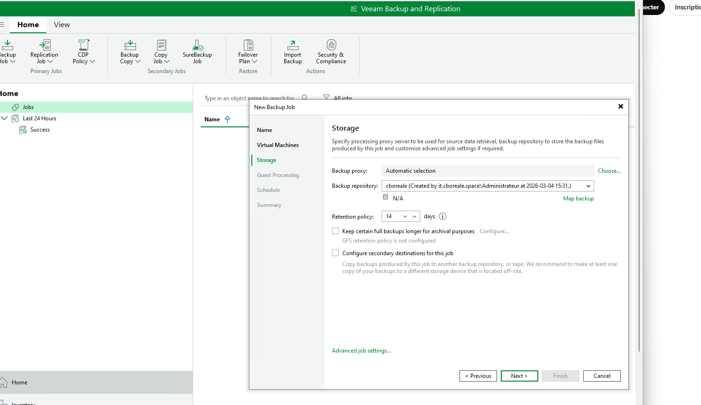
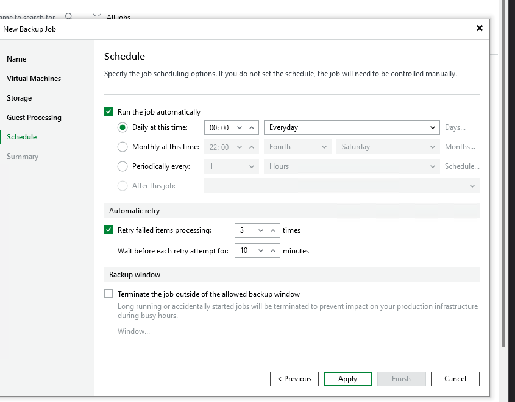
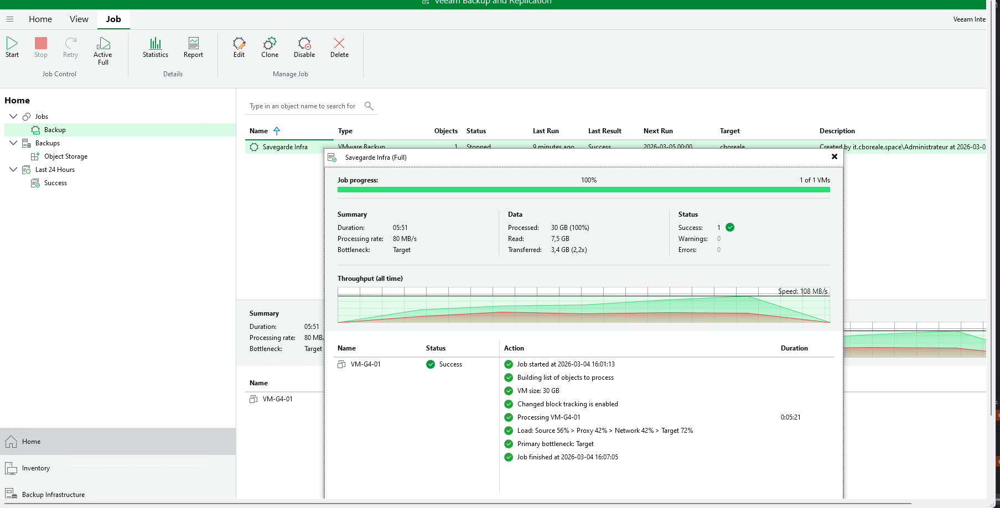
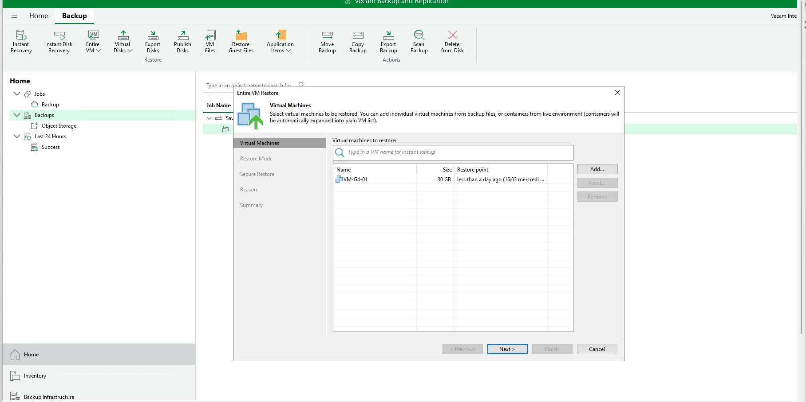
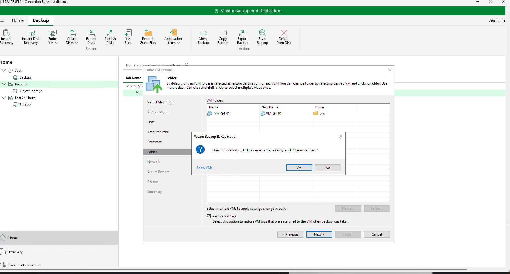
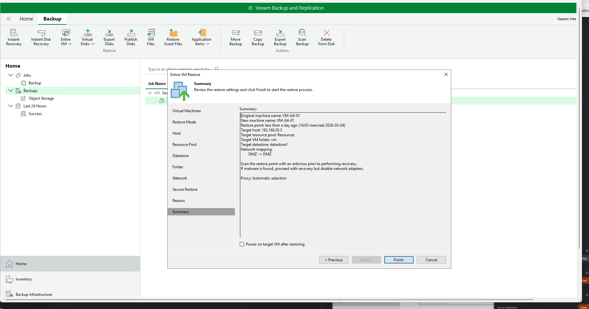
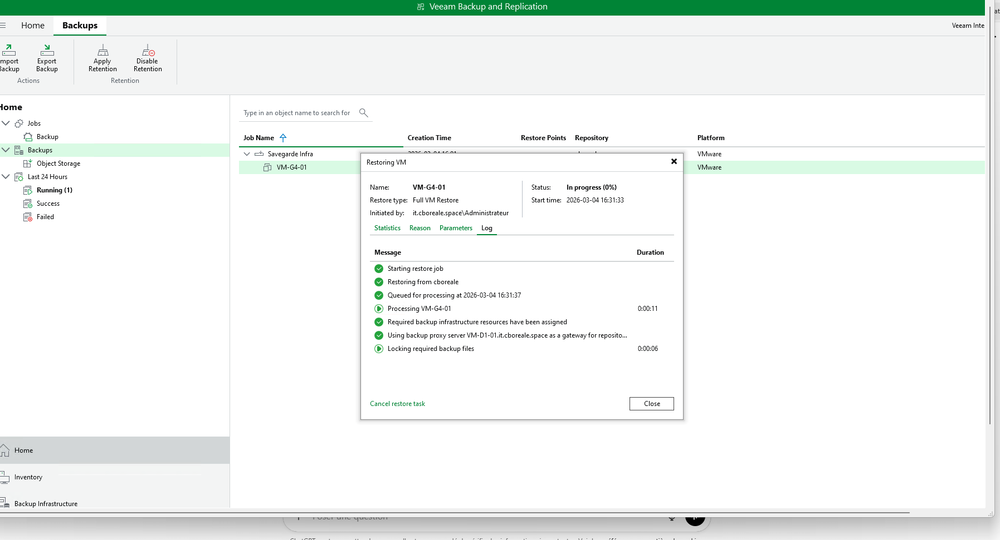
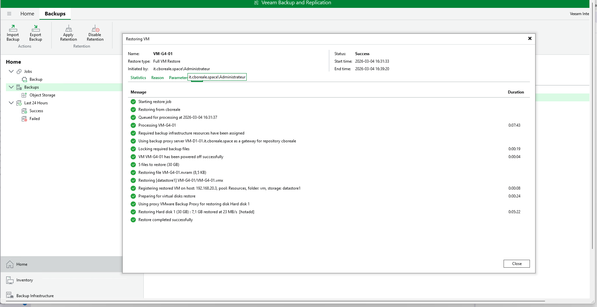

# Livrable – Sauvegarde et Restauration

## Objectif
L’objectif de ce livrable est de mettre en place une stratégie de sauvegarde et de restauration pour l’infrastructure déployée.  
Cela inclut la configuration de sauvegardes, leur exécution et un test de restauration.  

L’outil choisi doit être adapté à votre infrastructure (ex : VEEAM, Proxmox Backup Server, etc.).

---

## 1. Choix de l’outil de sauvegarde
- **Outil sélectionné :**  Veeam
- **Raison du choix :**  Compatible VMware ESXi. Permet la sauvegarde complète et incrémentielle. Supporte la sauvegarde dans le cloud 
- **Machine hébergeant l’outil (si applicable) :**  Serveur Windows 2022 dédié avec Veeam installé

---

## 2. Configuration des sauvegardes
- **Cibles de sauvegarde :** VM webserver (VM-G4-01)
- **Fréquence des sauvegardes :**  Tous les jours à minuit.
- **Rétention :** (nombre de copies ou durée)  14 jours
- **Stratégie (complète, incrémentielle, différentielle) :**  Complète
- **Méthode de sauvegarde :** (locale, cloud, hybride)  Cloud

###  Capture d’écran – Configuration des sauvegardes

Politique retention 14 jours

Politique de JOB

