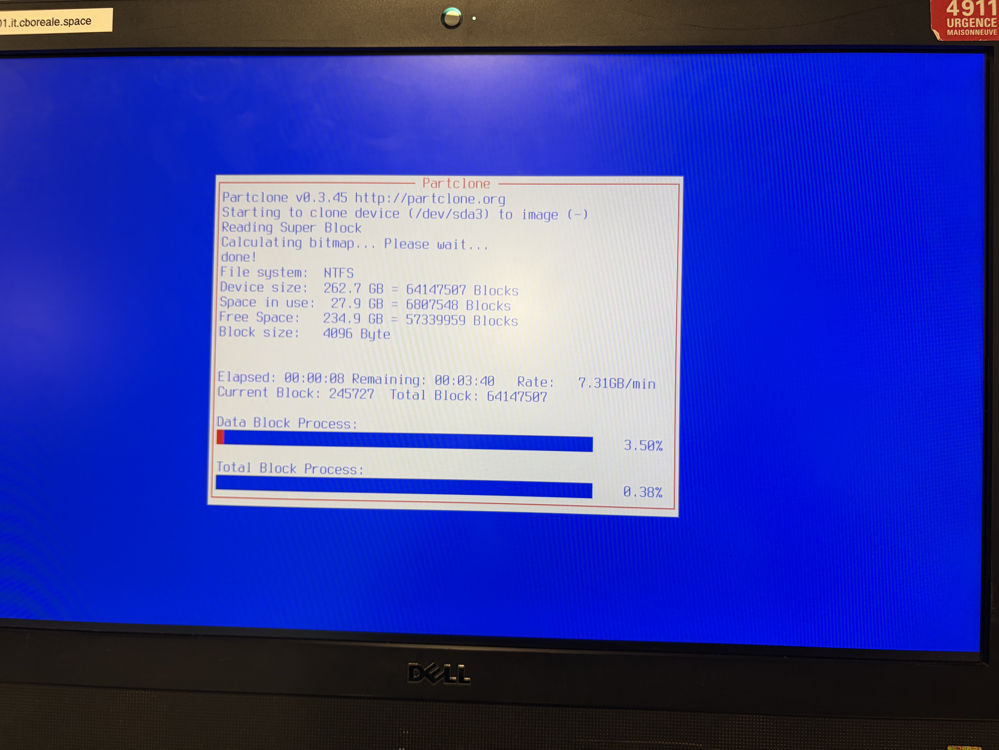
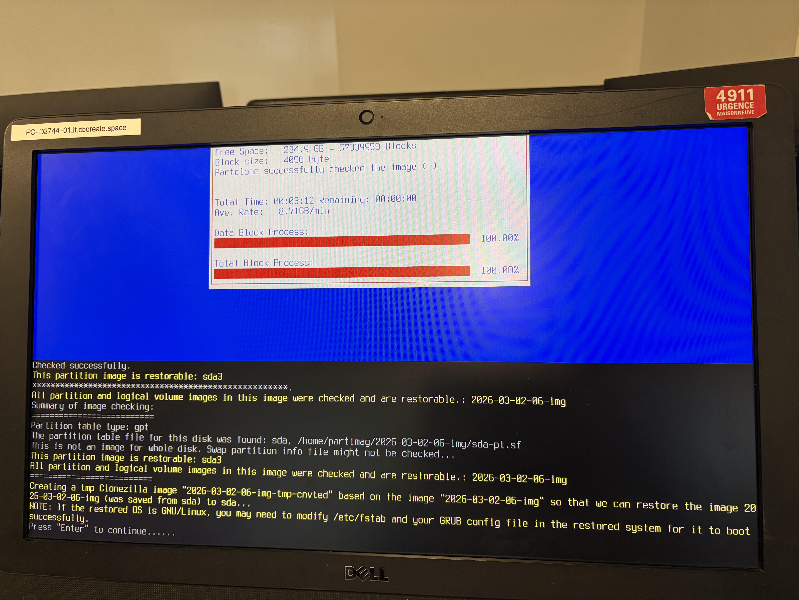

# Livrable 16 – Configuration d'un système de capture et de restauration d'image disque

## Objectif
L'objectif de ce livrable est de mettre en place un outil de capture et de restauration d'une image système afin de faciliter le déploiement et la récupération rapide d'une station de travail dans votre entreprise.

---

## 1. Capture d’une image système

### Pré-requis
- Station de travail entièrement configurée et mise à jour.
- Tous les logiciels du Livrable 15 installés.
- Présence d’une partition DATA (D:) qui sera exclue de la capture.

### Instructions
1. Démarrer la station de travail avec l’outil de capture choisi (ex: Clonezilla, Acronis, Macrium Reflect, ou Windows Deployment Services - WDS).  
2. Sélectionner le **disque principal (C:)** comme source de capture.  
3. Enregistrer l’image sur la **partition secondaire (D:)**.  
4. Vérifier l’intégrité de l’image après la capture.


### Schéma du processus de capture et restauration de Clonezilla

```text
[Poste Windows configuré]  
        │
        ▼
  Démarrage Clonezilla
        │
        ▼
 [Sélection mode device-image]  
        │
        ▼
  Montage partition DATA (D:) comme /home/partimag
        │
        ▼
     saveparts → sélection C: uniquement
        │
        ▼
     Compression z1p + fsck
        │
        ▼
  Création de l'image : image_windows_livrable16
        │
        ▼
   Vérification intégrité de l'image
        │
        ▼
  Image stockée sur D:/livrable16_clonezilla
        │
        ▼
-----------------------------
Restauration sur machine vierge
-----------------------------
        │
        ▼
  Démarrage Clonezilla → device-image
        │
        ▼
  Montage D:/livrable16_clonezilla
        │
        ▼
  restoreparts → restauration de C:
        │
        ▼
  Redémarrage Windows restauré
        │
        ▼
 Vérification logiciels et configuration
Insérez une capture d'écran (photo) pendant la capture de l'image de la partition C:.
```
Capture de la capture backup

Capture de la restauration

