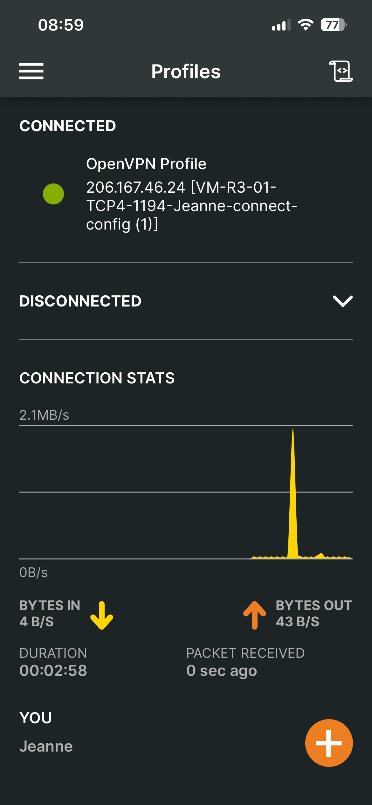

# Livrable - Configuration d’un VPN de télétravail
## Objectif
- L’objectif de ce livrable est de configurer un VPN (Virtual Private Network) pour permettre aux utilisateurs de se connecter à l’infrastructure depuis l’extérieur de manière sécurisée. Vous devez choisir un protocole VPN adapté à votre infrastructure (ex: OpenVPN, WireGuard, etc) et configurer le serveur VPN ainsi que les clients pour assurer une connexion sécurisée.
## Caractéristiques VPN
- **Nom du protocole** : OpenVPN, logiciel stable peut importe le système d'exploitation. Mise en place réalisé directement sur PFSense.
- **Certificats** : Création d'une autorité de certificats CA-College, permettant la création des certificats des 3 utilisateurs VPN.
- **Serveur VPN** : Utilise le protocole TCP sur le port 1194, chiffre les données en AES-256-GCM, AES-256-CBC. Le hashage se fait en SHA256. Le réseau de nottre tunnel VPN est le suivant > 10.10.10.0/24.
- **Firewall** : Une règle sur le WAN à été ajouté pour permettre le transfert de packets TCP sur le port 1194(OpenVPN), pour permettre la connexion.

